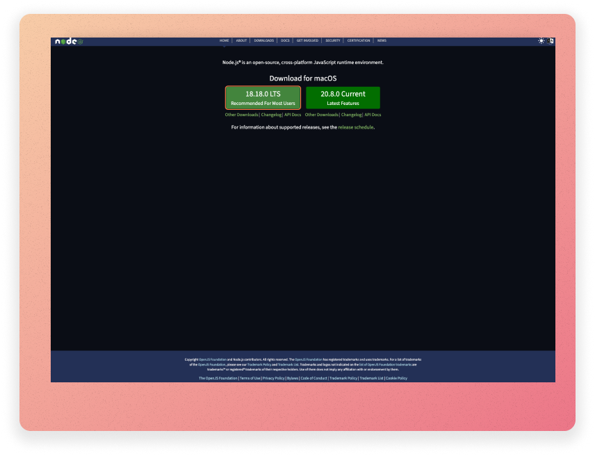
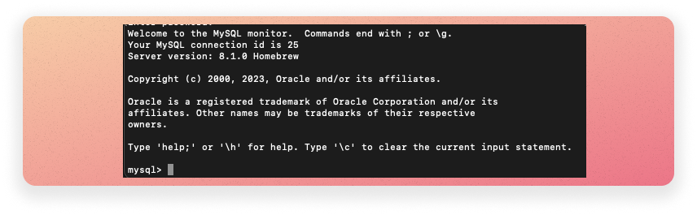
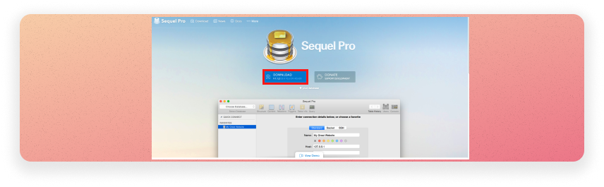
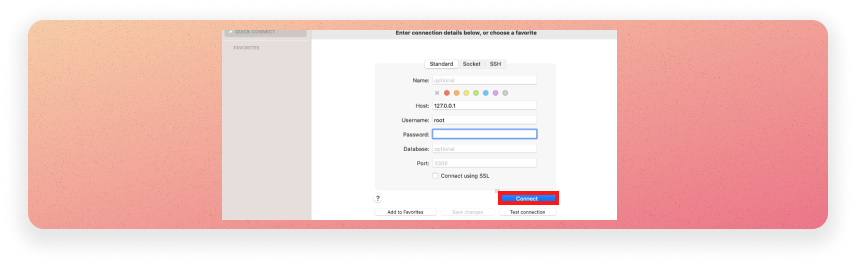

# Installing a home development environment on a Mac

If, like me, you are lucky enough to use a Mac; you can use the guide, below, to set up the development tools required for Web and Database Systems.

## Background 

Luckily, for this module, there are four pieces of software that you'll need, and all of them are free:

- **Node.js:**  [This is an "open-source, cross-platform JavaScript runtime environment"](https://nodejs.org/en). We will be using node for the web development portion of this module.
- **MySQL:** MySQL is a relational database management system (DBMS)
- **A Database Management Application:**  There are many to choose from. I have always found [Sequel Pro]( https://www.sequelpro.com/ a good choice) nice to use.
- A text editor: To write your programmes, you are going need a text editor. There are many to choose from, and they are all easy to install. I recommend [VSCode](https://code.visualstudio.com/) ; however, something as simple as [Notepad++](https://notepad-plus-plus.org/) is perfectly fine. **Due to the simplicity of install text editors, I won't tell you how to do this in this guide**.

Let's get going and set up our development environment.

### Installing Node.js

1. Go to the official Node.js website at [https://nodejs.org](https://nodejs.org/).
2. Click on the "LTS" button to download the LTS version.
3. A PKG installer file should automatically start to download.
4. Once the installer is downloaded, locate the file (usually in your Downloads folder) and double-click it to run it.
5. Follow the installation instructions provided by the installer.
6. After the installation is complete, you should see a message indicating that Node.js and npm (Node Package Manager) have been successfully installed.
7. To ensure that Node.js was installed correctly, open your terminal by opening your finder bar and typing Terminal in the search field, then click Terminal. Type in the following commands and press enter after each: 1. `node -v` - This command will display the version of Node.js you installed. 2. npm -v - This command will display the version of npm (Node Package Manager) that was installed.

## Installing MySql

Installing MySql is also straight forward.

1. First, we need to install the [homebrew](https://brew.sh/) package manager. If you don't have Homebrew installed, you can do so by opening Terminal and running this command:: `/bin/bash -c "$(curl -fsSL https://raw.githubusercontent.com/Homebrew/install/HEAD/install.sh)"`
2. Use Homebrew to install MySQL: `brew install mysql`.
3. Start the MySQL server: `brew services start mysql`

4. From terminal check you can access MySql by running the following command: `mysql -r root -p`. **When prompted for a password, just press enter.** You should see the output above.

## Installing a Database Management Application (DBMA)

While you can manage your databases using command line, it's sometimes nice to use visual tools to do this tasks. There are many available, and I am sure they are all great. Below, I will show you how to install Sequel Pro, a fast, easy-to-use Mac DBMS.

1. [Download and run the SQL Pro installer.](https://www.sequelpro.com/)

2. Open your installation of SQL pro and check you can connect to you MySQL database servers. Details are as follows:

   **Username:** 127.0.0.1
   **Password:** leave this blank
   **Port:** 3306 (this should the default, and there is no need to update)

3. Click connect, and you should see no connection errors.

That's it, you are good to go!
